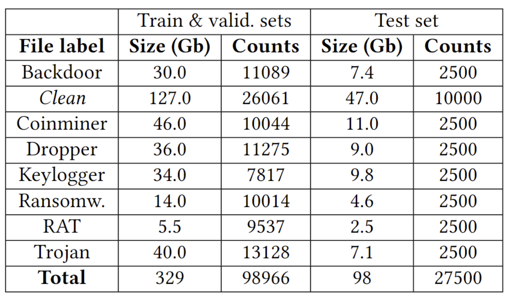
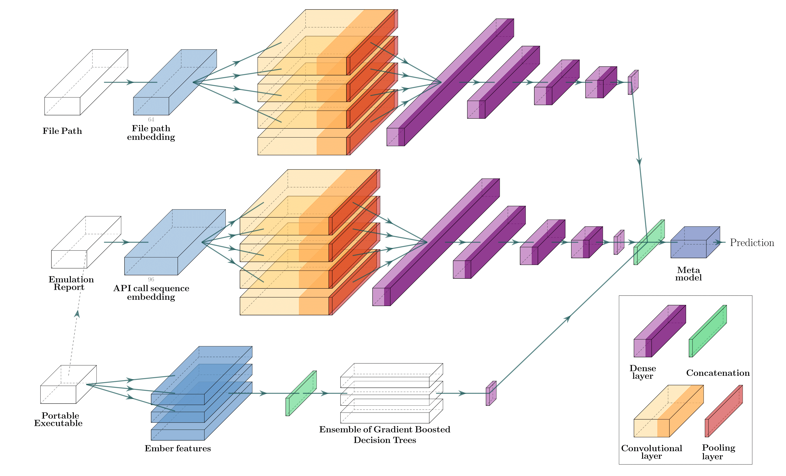
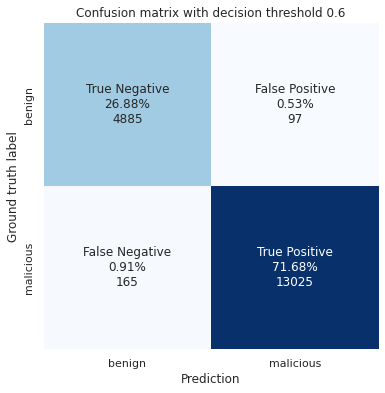
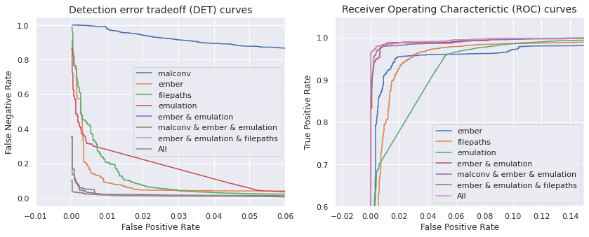
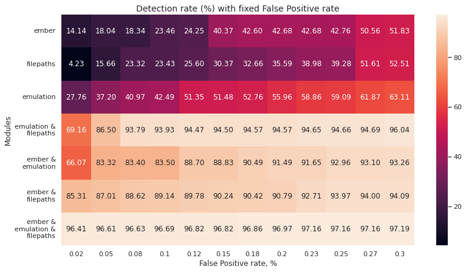

# Quo Vadis


<a href="https://twitter.com/intent/follow?screen_name=ditrizna"></a>

:warning: The model is a research prototype, provided as-is, without warranty of any kind, in a pre-alpha state.


## Dataset

Dataset structure used for model pre-training is as follows:

<p align="center"><br>

Raw PE samles and in-the-wild filepaths are not disclosed due to Privacy Policy. However,

- PE emulation dataset available in [emulation.dataset](data/emulation.dataset/)
- Filepath dataset (open sources only, in-the-wild paths used for pre-training are excluded):
  - augmented [samples](data/path.dataset/dataset_malicious_augumented.txt) and [logic](data/path.dataset/augment/augmentation.ipynb)
  - [paths](data/path.dataset/dataset_benign_win10.txt) from clean Windows 10 host

## Citation

This repository is part of the following publication: <https://dl.acm.org/doi/10.1145/3560830.3563726>

If you are inspired by the work or use data, please cite us:

```bibtex
@inproceedings{10.1145/3560830.3563726,
author = {Trizna, Dmitrijs},
title = {Quo Vadis: Hybrid Machine Learning Meta-Model Based on Contextual and Behavioral Malware Representations},
year = {2022},
isbn = {9781450398800},
publisher = {Association for Computing Machinery},
address = {New York, NY, USA},
url = {https://doi.org/10.1145/3560830.3563726},
doi = {10.1145/3560830.3563726},
booktitle = {Proceedings of the 15th ACM Workshop on Artificial Intelligence and Security},
pages = {127–136},
numpages = {10},
keywords = {reverse engineering, neural networks, malware, emulation, convolutions},
location = {Los Angeles, CA, USA},
series = {AISec'22}
}
```

## Architecture

Hybrid, modular structure for **malware classification**. Supported modules:

- 1D convolution neural network analysis of *API call sequence* obtained from [Speakeasy emulator](https://github.com/mandiant/speakeasy/)
- 1D convolution neural network analysis of filepath at the moment of execution (Kyadige and Rudd et al., <https://arxiv.org/abs/1905.06987>)
- '*Ember*' Gradient Boosted Decision Tree (GBDT) model  (Anderson and Roth, <https://arxiv.org/abs/1804.04637>)
- '*MalConv*' byte-level convolutional neural network (Raff et al., <https://arxiv.org/abs/1710.09435>)

<p align="center"><br>

## Environment Setup

Tested on Python `3.8.x` - `3.9.x`. Because of a large number of dependencies with specific versions (due to pre-trained machine learning models), we suggest using a virtual environment or `conda`:

```bash
% python3 -m venv QuoVadisEnv
% source QuoVadisEnv/bin/activate
(QuoVadisEnv)% python -m pip install -r requirements.txt
```

## Usage

API interface is available under `models.py`.

### Definition of classifier

```python
from models import CompositeClassifier

classifier = CompositeClassifier(meta_model = "MultiLayerPerceptron", 
                                   modules = ["ember", "emulation"],
                                   root = "/home/user/quo.vadis/",
                                   load_meta_model = True)
```

Available pretrained configurations:

```python
meta_model = 'LogisticRegression', modules = ['ember', 'emulation', 'filepaths', 'malconv']
meta_model = 'MultiLayerPerceptron', modules = ['ember', 'emulation']
meta_model = 'MultiLayerPerceptron', modules = ['ember', 'emulation', 'filepaths']
meta_model = 'MultiLayerPerceptron', modules = ['ember', 'emulation', 'filepaths', 'malconv']
meta_model = 'MultiLayerPerceptron', modules = ['emulation']
meta_model = 'MultiLayerPerceptron', modules = ['filepaths']
meta_model = 'XGBClassifier', modules = ['ember', 'emulation']
meta_model = 'XGBClassifier', modules = ['ember', 'emulation', 'filepaths']
meta_model = 'XGBClassifier', modules = ['ember', 'emulation', 'filepaths', 'malconv']
meta_model = 'XGBClassifier', modules = ['emulation']
meta_model = 'XGBClassifier', modules = ['filepaths']
```

### Evaluation on PE list

```python
pefiles = os.listdir("/path/to/PE/samples")
x = classifier.preprocess_pelist(pefiles)
probs = classifier.predict_proba(x)
```

You can use `predict_proba_pelist()` instead of `predict_proba()` to get probabilities out of the PE list right away instead of a preprocessed array:

```python
probs = classifier.predict_proba_pelist(pefiles)
```

Given that `filepaths` is specified in `modules = `, you have to specify the filepaths of the PE sample at the moment of execution using the `pathlist=` argument:

```python
filepaths = pd.read_csv(filepaths.csv, header=None)
probs = classifier.predict_proba_pelist(pefiles, pathlist=filepaths.values.tolist())
```

*Note!* `len(pefiles) == len(filepaths)`

### Re-Training

Using the `fit_pelist()` method and providing ground true labels for PE files -- malware (1) or benign (0):

```python
labels = load_labels()
classifier.fit_pelist(pefiles, labels, pathlist=filepaths.values.tolist())
```

### Example

An example usage can be found under `example.py`:

```text
# python example.py --example --how ember emulation filepaths

[*] Loading model...
WARNING:root:[!] Loading pretrained weights for ember model from: ./modules/sota/ember/parameters/ember_model.txt
WARNING:root:[!] Loading pretrained weights for filepath model from: ./modules/filepath/pretrained/torch.model
WARNING:root:[!] Using speakeasy emulator config from: ./data/emulation.dataset/sample_emulation/speakeasy_config.json
WARNING:root:[!] Loading pretrained weights for emulation model from: ./modules/emulation/pretrained/torch.model
WARNING:root:[!] Loading pretrained weights for late fusion MultiLayerPerceptron model from: ./modules/late_fustion_model/MultiLayerPerceptron15_ember_emulation_filepaths.model

[*] Legitimate 'calc.exe' analysis...
WARNING:root:[!] Taking current filepath for: evaluation/adversarial/samples_goodware/calc.exe
WARNING:root: [+] 0/0 Finished emulation evaluation/adversarial/samples_goodware/calc.exe, took: 0.19s, API calls acquired: 6
[!] Given path evaluation/adversarial/samples_goodware/calc.exe, probability (malware): 0.000005
[!] Individual module scores:

       ember  filepaths  emulation
0  0.000015    0.00319   0.062108 

WARNING:root: [+] 0/0 Finished emulation evaluation/adversarial/samples_goodware/calc.exe, took: 0.11s, API calls acquired: 6
[!] Given path C:\users\myuser\AppData\Local\Temp\exploit.exe, probability (malware): 0.549334
[!] Individual module scores:

       ember  filepaths  emulation
0  0.000015   0.999984   0.062108 

[*] BoratRAT analysis...
WARNING:root: [+] 0/0 Finished emulation ./b47c77d237243747a51dd02d836444ba067cf6cc4b8b3344e5cf791f5f41d20e, took: 0.25s, API calls acquired: 194

[!] Given path %USERPROFILE%\Downloads\BoratRat.exe, probability (malware): 0.9997
[!] Individual module scores:

       ember  filepaths  emulation
0  0.035511   0.999602    0.96526 

WARNING:root: [+] 0/0 Finished emulation ./b47c77d237243747a51dd02d836444ba067cf6cc4b8b3344e5cf791f5f41d20e, took: 0.25s, API calls acquired: 194

[!] Given path C:\windows\system32\calc.exe, probability (malware): 0.0392
[!] Individual module scores:

       ember  filepaths  emulation
0  0.035511   0.086567    0.96526 
```

## Evaluation

More detailed information about modules and individual tests:

- `./modules/emulation/`
- `./modules/filepaths/`
- `./modules/sota/`

Note! Parameters for the `sota` models can be downloaded from [here](https://github.com/endgameinc/malware_evasion_competition/tree/master/models).

Performance of this model on the proprietary dataset: ~90k PE samples with filepaths from real-world systems:

<center></center><br>

DET and ROC curves:

<center></center><br>

Detection rate with fixed False Positive rate:

<center></center><br>

## Future work

- Experiments with **retrained** MalConv / Ember weights -- it makes sense to evaluate them on the same distribution
  - *Note*: this, however, does not matter since our goal is **not** to compare our modules with MalConv / Ember directly but to improve them. For this reason, it is even better to have original parameters. The main takeaway -- adding multiple modules together allows boosting results drastically. At the same time, each is noticeably weaker (even the API call module, which is trained on the same distribution).
- Run GAMMA against composite solution (not just ember/malconv modules) - it looks like attacks are highly targeted. Interesting if it will be able to generate evasive samples against a complete pipeline .. (however, defining that in `secml_malware` might be painful ...)
- Work on `CompositeClassifier()` API interface:
  - make it easy to take a PE sample(s) & additional document options (providing PE directory, predefined emulation report directory, etc.)
  - `.update()` to overtrain network with own examples that were previously flagged incorrectly
  - work without submitted `filepath` (only PE mode) - provide paths as separate argument to `.fit()`?
- Additional modules:
  - (a) Autoruns checks (see Sysinternals book for a full list of registries analyzed)
  - (b) network connection information
  - etc.
