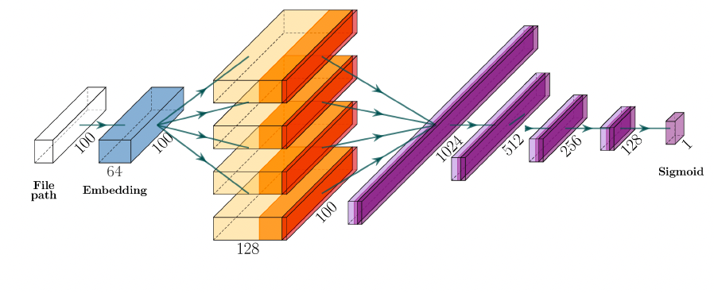
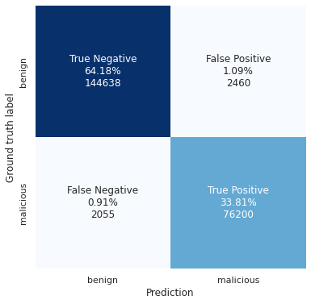

# Quo Vadi

`data/` - datasets and related code
- [PE emulation dataset](data/emulation.dataset/emulation.dataset.7z)
- Filepath dataset (from open sources only because of Privacy Policy: 
  - augmented [samples](data/path.dataset/dataset_malicious_augumented.txt) and [logic](data/path.dataset/augment/augmentation.ipynb)
  - [paths](data/path.dataset/dataset_benign_win10.txt) from clean Windows 10 host

`modules/quo.vadis.primus/` - original filepath prediction pipeline based on 1D-convolutional neural network  

 

<!--Performance of final model: 

 -->

`modules/morbus.certatio/` -  pipeline based on Windows Kernel emulation based on Speakeasy [emulator](https://github.com/mandiant/speakeasy) from Mandiant  

`modules/sota/` - static PE classification state-of-the-art ML-models: [MalConv](modules/sota/malconv) or [Ember](modules/sota/ember)

