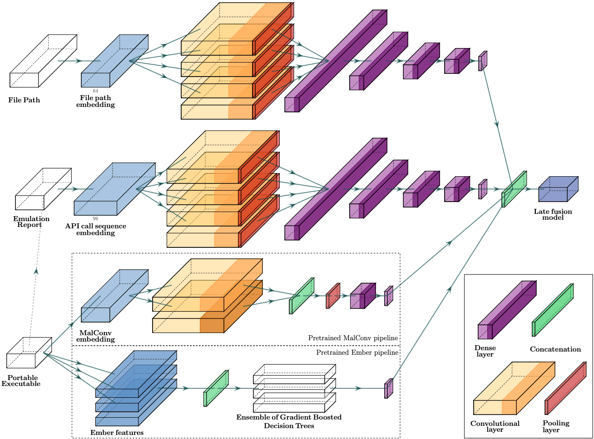

# Quo Vadis

:warning: The model is a research prototype in an early alpha state.

Composite, modular structure for **malware classification**. Main API interface under: `./models.py`. Current architecture:

 

More detailed information about modules and individual tests:

- `./modules/emulation/` - 1D convolutonal pipeline based on API call sequences collected with Windows kernel emulator (we use [Mandiant's Speakeasy](https://github.com/mandiant/speakeasy))
- `./modules/filepaths/` - 1D convolution pipeline for file path classification
- `./modules/sota/` - static PE classification utilizing state-of-the-art ML-models: [MalConv](modules/sota/malconv) or [Ember](modules/sota/ember). Parameters for `sota` models can be downloaded from [here](https://github.com/endgameinc/malware_evasion_competition/tree/master/models).

Performance of this model on the proprietary dataset - 90k PE samples with filepaths from real-world systems:

 

DET and ROC curves:

 

Detection rate with fixed False Positive rate:

 

## `data/` - datasets and data related code

- [PE emulation dataset](data/emulation.dataset/emulation.dataset.7z)
- Filepath dataset (from open sources only because of Privacy Policy):
  - augmented [samples](data/path.dataset/dataset_malicious_augumented.txt) and [logic](data/path.dataset/augment/augmentation.ipynb)
  - [paths](data/path.dataset/dataset_benign_win10.txt) from clean Windows 10 host

## Considerations:

- try experiments with **retrained** MalConv / Ember weights on your dataset - it makes sense to evaluate them on the same distribution
  - NOTE: this, however, does not matter since our goal is **not** to compare our modules with MalConv / Ember directly but to improve them. For this reason, it is even better to have original parameters. The main takeaway - adding multiple modules together allows boosting results drastically. At the same time, each of them is noticeably weaker (even the API call module, which is trained on the same distribution).
- try to run GAMMA against composite solution (not just ember/malconv modules) - it looks like attacks are highly targeted. Interesting if it will be able to generate evasive samples against a complete pipeline .. (however, defining that in `secml_malware` might be painful ...)
- work on `CompositeClassifier()` API interface:
  - make it easy to take a PE sample(s) & additional document options (providing PE directory, predefined emulation report directory, etc.)
  - `.update()` to overtrain network with own examples that were previously flagged incorrectly
  - work without submitted `filepath` (only PE mode) - provide paths as separate argument to `.fit()`?
- Additional modules:
  - (a) Autoruns checks (see Sysinternals book for a full list of registries analyzed)
  - (b) network connection information
  - etc.
