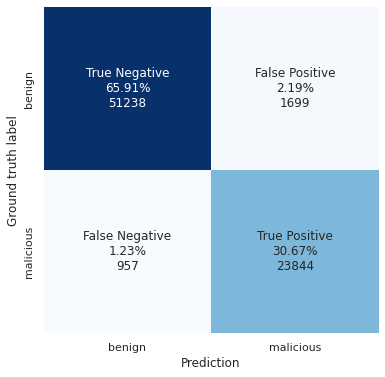

# Maliciousness prediction based on file-path

## Intermediate results

Data used for training:

- Threat Intelligence one-day data from AV telemetry (~160k entries)
- default Windows 10 files (~80k entries)

Result can be seen under `tests/PROD_RUN/`, confusion matrix on validation set:

Need more data to generalize better.

## Further Dataset formation

- Clean:
    - ~~default Windows files~~
    - default files in `sysvol`  
    - ~~corporate `[net]` shares~~: `../data/path.dataset/smbmap*`  

- Threat Intelligence:
    - more days of Threat Intelligence filepath data
    - ITW malware PE: `../data/pe.dataset/`

- Synthetic data:
    - `system32` binaries outside of `C:\windows\system32\` as malware?
    - `report.docx`, etc. under downloads/desktop as benign (usual office stuff) 
        - collect from somewhere (coleagues?) ask to execute: `gci -path $env:userprofile -recurse`

## Actions for error correction:

- Create backwards function of `mapped_array > string`
- Dump TP/FP/FN/TN goodware / malware lists in a separate files - evaluate what samples are classified correct, what not?

## Model pipeline ideas list:

- Parse `folder` and `filename` informations separately
    - own parts of NN, and then join?
    - enrich with access rights - user / world / admin writable?
- Add `time` information - malware files in TI telemetry appear in a short time on multiple systems
