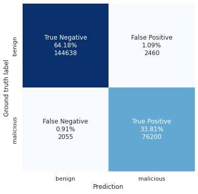

# Maliciousness prediction based on file-path

## Intermediate results

Result can be seen under `tests/PROD_RUN_EXTENDED_DATASET/`, confusion matrix on validation set:

Need more data to generalize better.

## Dataset formation

- Clean:
    - default Windows files
    - default files in `sysvol`  
    - corporate `[net]` shares

- Threat Intelligence:
    - in-the-wild (ITW) malware paths during execution

- Synthetic data:
    - `system32` binaries outside of `C:\windows\system32\` - DLL sideloading, exe tampering
    - non usual `exe` and `dll` files in world writable directories like `c:\windows\tasks`
    - `invoice.docm`, etc. under downloads/desktop

## Actions for error correction:

- Create backwards function of `mapped_array > string`
- Dump TP/FP/FN/TN goodware / malware lists in a separate files - evaluate what samples are classified correct, what not?

## Model pipeline ideas list:

- Parse `folder` and `filename` informations separately
    - own parts of NN, and then join?
    - enrich with access rights - user / world / admin writable?
- Add `time` information - malware files in TI telemetry appear in a short time on multiple systems
